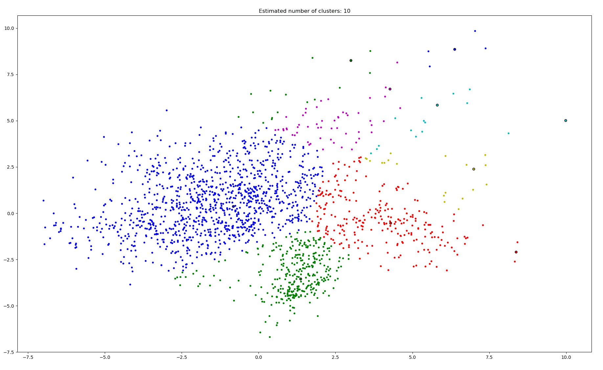

# Data mining

数据班 赵鑫鉴  201700181053
## Requirements
+ python==3.7.4
+ textblob==0.15.3
+ scikit-learn ==0.21.3（0.20.3以下版本可能会报错）
+ NumPy (>= 1.11.0)
+ SciPy (>= 0.17.0)
+ joblib (>= 0.11)

运行此代码需要安装sklearn，可以参考以下几种下载或者更新方式：
```
使用清华镜像下载：
pip install -i https://pypi.tuna.tsinghua.edu.cn/simple scikit-learn
更新：
pip install --upgrade scikit-learn
conda update scikit-learn
pip install -U sklearn
```

