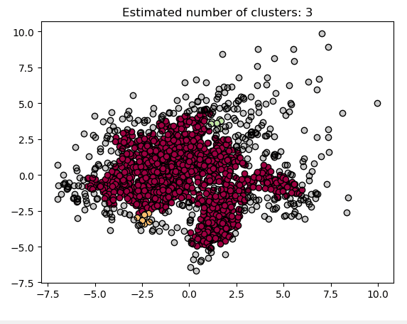

# Data mining
>Homework 2: Clustering with sklearn 

>数据班 赵鑫鉴  201700181053
## Requirements
+ python==3.7.4
+ **scikit-learn ==0.21.3（0.20.3以下版本可能会报错）**
+ NumPy (>= 1.11.0)
+ SciPy (>= 0.17.0)
+ joblib (>= 0.11)

&emsp;运行此代码需要安装sklearn，可以参考以下几种下载或者更新方式：
```
使用清华镜像下载：
pip install -i https://pypi.tuna.tsinghua.edu.cn/simple scikit-learn
更新：
pip install --upgrade scikit-learn
conda update scikit-learn
pip install -U sklearn
```
## Dataset：
本次任务使用两个sklearn内置的数据集：

1.20newsgroups：

&emsp;该数据集是用于文本分类、文本挖据和信息检索研究的国际标准数据集之一。数据集收集了大约20,000左右的新闻组文档，均匀分为20个不同主题的新闻组集合。一些新闻组的主题特别相似(e.g. comp.sys.ibm.pc.hardware/ comp.sys.mac.hardware)，还有一些却完全不相关 (e.g misc.forsale /soc.religion.christian)。

2.digits：

这个数据集中并没有图片，而是经过提取得到的手写数字特征和标记，就免去了我们的提取数据的麻烦，但是在实际的应用中是需要我们对图片中的数据进行提取的。

digits导入使用示例：
```
from sklearn.datasets import load_digits
digits = load_digits()
data = scale(digits.data)
n_samples, n_features = data.shape
n_digits = len(np.unique(digits.target))
labels = digits.target
```

## 任务要求：
在sklearn内置的数据集中评测不同聚类算法的聚类效果，使用三种评价指标和算法时间复杂度评测聚类效果：
## Evaluation：
+ Normalized Mutual Information (NMI)
+ Homogeneity: each cluster contains only members of a single class
+ Completeness: all members of a given class are assigned to the same cluster


## 实验结果部分可视化展示：


meanshift：


kmeans++


AffinityPropagation：


DBSCAN：DBSCAN的聚类定义很简单：由密度可达关系导出的最大密度相连的样本集合，即为我们最终聚类的一个类别，或者说一个簇。

这个DBSCAN的簇里面可以有一个或者多个核心对象。如果只有一个核心对象，则簇里其他的非核心对象样本都在这个核心对象的ϵ-邻域里；如果有多个核心对象，则簇里的任意一个核心对象的ϵ-邻域中一定有一个其他的核心对象，否则这两个核心对象无法密度可达。这些核心对象的ϵ-邻域里所有的样本的集合组成的一个DBSCAN聚类簇。


下面展示不同参数（半径）下的聚类情况

DBSCAN 0.3：


DBSCAN 0.33：


DBSCAN 0.4：




20newsgroups数据集:


