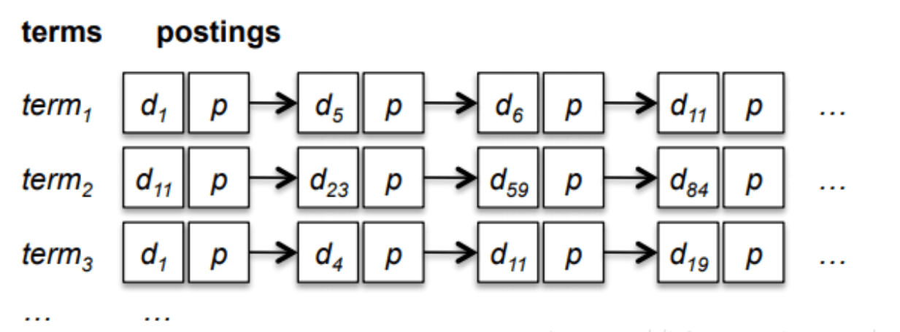
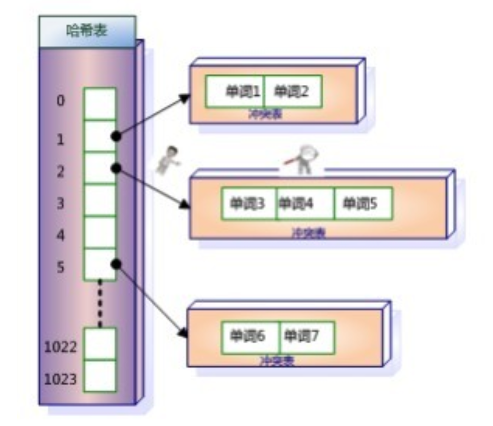
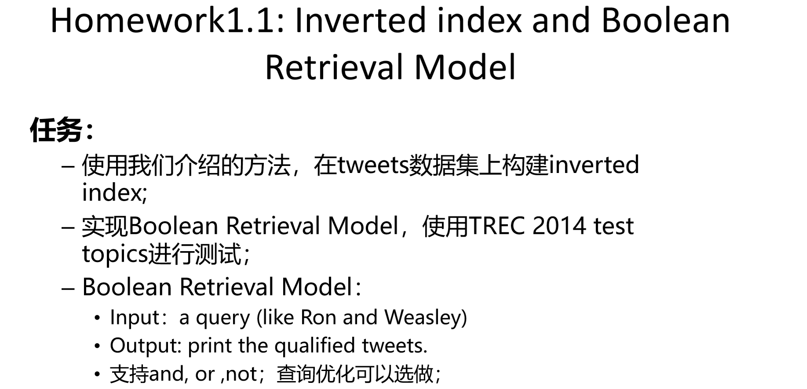
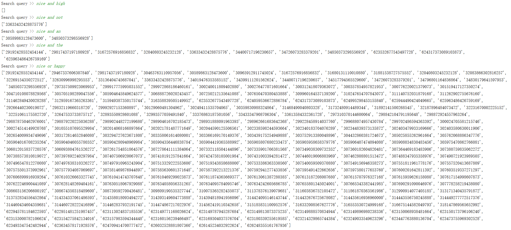
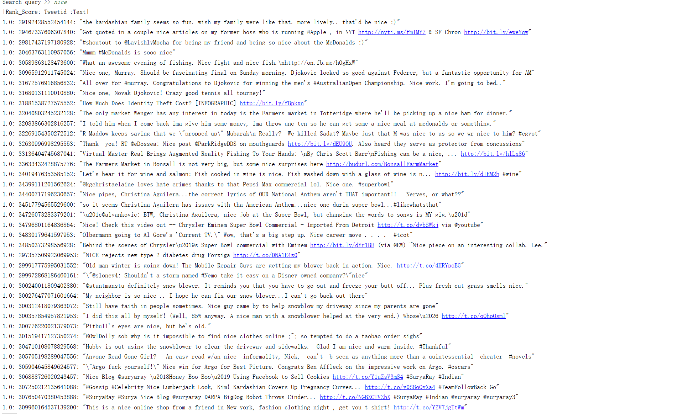

# IR2019
> Homework1.1: Inverted index and Boolean Retrieval Model




## Inverted index

&emsp;用户在主页上搜索关键词“华为手机”时，假设只存在正向索引（forward index），那么就需要扫描索引库中的所有文档，找出所有包含关键词“华为手机”的文档，再根据打分模型进行打分，排出名次后呈现给用户。<br>

&emsp;这种做法无疑是相对低效的。建立倒排索引可以大大减小检索的范围。一个比较自然的想法是：“对于每一个需要检索的词汇，如果能够有一个专门的检索空间就好了。”为了达到这个目的，显然我们需要**存储每个单词对应的检索空间信息**。对于文档来说，每个文件有着唯一的文档号，所以可以考虑用文档号列表表示某个单词的存储空间。这就是倒排索引的思想。<br>

以下是倒排索引的定义与基本知识：

&emsp;倒排索引(Inverted Index)：倒排索引是实现“单词-文档矩阵”的一种具体存储形式，通过倒排索引，可以根据单词快速获取包含这个单词的文档列表。倒排索引主要由两个部分组成：“单词词典”和“倒排文件”。

&emsp;单词词典(Lexicon)：搜索引擎的通常索引单位是单词，单词词典是由文档集合中出现过的所有单词构成的字符串集合，单词词典内每条索引项记载单词本身的一些信息以及指向“倒排列表”的指针。对于一个规模很大的文档集合来说，可能包含几十万甚至上百万的不同单词，能否快速定位某个单词，这直接影响搜索时的响应速度，所以需要高效的数据结构来对单词词典进行构建和查找，常用的数据结构包括哈希加链表结构和树形词典结构。



&emsp;倒排文件(Inverted File)：所有单词的倒排列表往往顺序地存储在磁盘的某个文件里，这个文件即被称之为倒排文件，倒排文件是存储倒排索引的物理文件。

## Boolean Retrieval
信息检索是从大规模非结构化数据（通常是文本）的集合（通常保存在计算机上）中找出满足用户信息需求的资料（通常是文档）的过程。

看完信息检索的定义我们能感觉到显然在信息检索中只满足单个词项的查询是远远不够的。在日常生活中我们需要能检索出：“**莎士比亚的哪部剧本包含Brutus及Caesar但是不包含Calpurnia**？”这样的问题。

我们**不可能为每一个这样的查询对存储对应的检索空间**，但是我们可以**通过将相关词项的检索空间进行某些操作来确定这样一个查询的检索空间**。之前，我们已经建立了索引，现在我们怎么利用这个来处理查询。首先，我们需要定位某个词项，然后返回倒排记录表，在根据交还是并来处理我们的倒排记录表。
and是交集，or是并集，not是减。这就是布尔查询的思想：

*Boolean Retrieval：针对布尔查询的检索，布尔查询是指利用 AND, OR 或者 NOT操作符将词项连接起来的查询。*
## 实验任务

## Requirements
+ python==3.7
+ textblob==0.15.3
+ collections
## 实现细节
1.下载并观察tweets数据集的结构，用一个列表uselessTerm作为tweets数据集的分割标准，取出username，tweetid和text：
```sh
{"userName": "Mariah Peoples", "clusterNo": 82, "text": "House may kill Arizona-style immigration bill, Rep. Rick Rand says: The House is unlikely to pass the \"Ari... http://tinyurl.com/4jrjcdz", "timeStr": "Sun Jan 23 00:02:37 +0000 2011", "tweetId": "28965792812892160", "errorCode": "200", "textCleaned": " ", "relevance": 2}
```
```sh
uselessTerm = ["username","clusterno" ,"tweetid","errorcode","text","timestr"]
```

2.为了更加精确的对数据进行查询我们需要使用TextBlob包中的lemmatize() 方法 对单词进行词形还原，名词找单数，动词找原型。

3.读入的每一行进行分词，并且删去tweeid，用一个数组存储tweeid。使用set()函数去重。对于此行的所以单词做判断，如果某一个单词出现在了词表之中，将该行的tweetid加入该单词的倒排索引表，如果没有出现，则将该单词加入词表再将tweetid加入倒排索引表。
```sh
unique_terms = set(line1)
```
4.实现不同的Merge函数与NaiveSearch函数

&emsp;Merge函数利用指针的思想可以很直观的编写出来。例如and的复杂度是O(x+y).我们对长度为x与长度为y的两个倒排索引表进行操作，不断移动下标，取出同时出现的单词。**当然“快”的那一方有时候是需要下标不变的。** 拥有两个连接词的Merge与原始Merge差别不大，稍作调整即可。

&emsp;在NaiveSearch里是对单个单词进行查询，提供了提供了返回具体内容不仅仅是返回id号的功能。**初始代码编写复杂度过高，对每一个求得的tweetid去数据库中查找相应的原始片段并提取文本（会乱序），后来选择将求得的tweetid存储在列表中，只需遍历一次数据库，效率大大提高，从约1min给出一条记录到一两秒的时间能得出一条记录，并且该做法不会导致乱序。**

