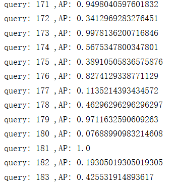
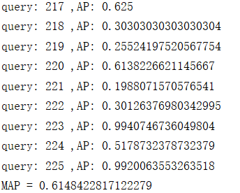
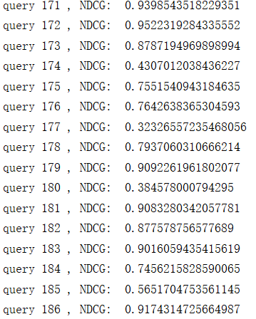
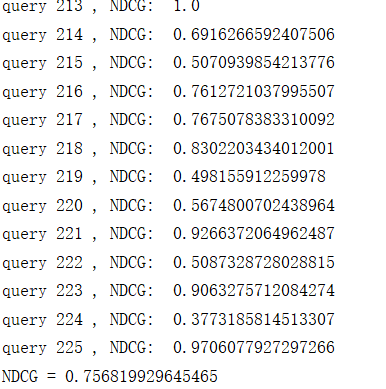
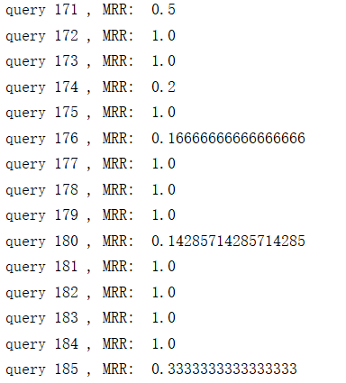
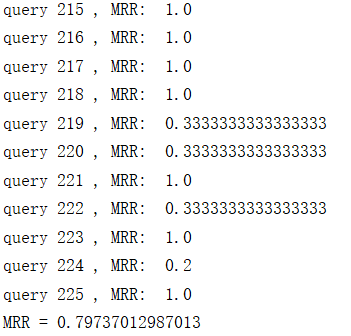

# IR2019
> Homework1.3: IR Evaluation

**赵鑫鉴 数据班 201700181053**
## 实验任务
实现以下指标评价，并对HW1.2检索结果进行评价 

• Mean Average Precision (MAP) 

• Mean Reciprocal Rank (MRR) 

• Normalized Discounted Cumulative Gain (NDCG)
## Mean Average Precision (MAP) 
mean average precision (mAP) of a set of queries is defined as such:

其中Q是集合中查询的数量，AveP(q)是给定查询q的平均精度（AP）：

&emsp;平均准确率是每篇相关文档检索出后的准确率的平均值。主集合的平均准确率(MAP)是每个主题的平均准确率的平均值。MAP 是反映系统在全部相关文档上性能的单值指标。系统检索出来的相关文档越靠前(rank 越高)，MAP就可能越高。如果系统没有返回相关文档，则准确率默认为0。
## Mean Reciprocal Rank (MRR) 
&emsp;RR（reciprocal rank）倒数排名，指检索结果中第一个相关文档的排名的倒数。

&emsp;具体来说：对于一个query，若第一个正确答案排在第n位，则RR得分就是1/n（如果没有正确答案，则得分为0）。

&emsp;而MRR的核心思想很简单：返回的结果集的优劣，跟第一个正确答案的位置有关，第一个正确答案越靠前，结果越好。MRR为所有query的RR的平均值。

其中，Q为样本query集合，|Q|表示Q中query个数，ranki表示在第i个query中，第一个正确答案的排名。
## Normalized Discounted Cumulative Gain (NDCG)
&emsp;NDCG（normalized discounted cumulative gain，归一化折损累计增益）是一种近年来逐渐被采用的指标，尤其是在基于机器学习的排序方法中。NDCG是针对连续值的指标，它基于前k个检索结果进行计算。设R(j,d)是评价人员给出的文档d对查询j的相关性得分（通常是一个概率），那么有：

## Requirements
+ python==3.7
+ textblob==0.15.3
+ collections
+ **运行此项目您必须要使用此文件：https://trec.nist.gov/data/microblog/2014/qrels2014.txt**
+ 更换数据集时只需手工更换文本文件
## 运行结果

