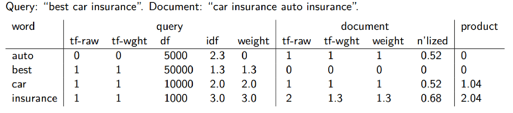
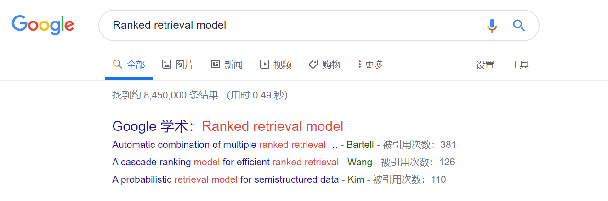
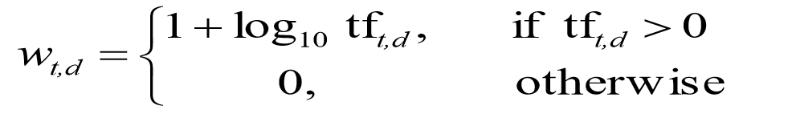

# IR2019
>Homework1.2: Ranked retrieval model

*赵鑫鉴 数据班 201700181053*

&emsp;在实验一中实现了倒排索引和布尔查询处理办法，给定一个布尔查询，一篇文档要么满足查询的要求，要么不满足要求。在文档集规模很大的情况下，满足布尔查询的结果文档数量可能 非常多，往往会大大超过用户能够浏览的文档的数目。因此，对搜索引擎来说，对文档进行评 分和排序非常重要。为此，对于给定的查询，搜索引擎会计算每个匹配文档的得分。

&emsp;一个好的搜索引擎需要快速的返回与输入query相关度高的文档，所以如何衡量相似度是一个很重要的问题。我们在信息检索课程中学习了以下一些衡量相似度的计算方式，并尝试在本次实验中加以实现。

&emsp;如果文档或者域中词项出现的频率越高，那么该文档或者域的得分也越高。这是一种很自然的想法。首先，我们对于词项t，根据其在文档d中的权重来计算它的得分。简单的方式是将权重设置为t在文档中的出现次数。这种权重计算的结果称为词项频率（term frequencey）。同时我们注意到“**Relevance does not increase proportionally with term frequency**”,所以在实际设计中并不是采用这种简单的方法。在本次实验中我们采用的是Log-frequency weighting：

&emsp;原始的词项频率会面临这样一个严重问题，即在和查询进行相关度计算时，所有的词项都被认为是同等重要的。实际上,某些词项对于相关度计算来说几乎没有或很少有区分能力。 例如，在一个有关汽车工业的文档集中，几乎所有的文档都会包含auto，此时，auto就没有区分能力。为此，需要一种机制来降低这些出现次数过多的词项在相关性计算中的重要性。一个很直接的想法就是给文档集频率（collection frequency）较高的词项赋予较低的权重，其中文档集频率指的是词项在文档集中出现的次数。这样，便可以降低具有较高文档集频率的词项的权重。由于df本身往往较大，所以通常需要将它映射到一个较小的取值范围中去。所以在实际中我们常使用idf。

